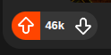
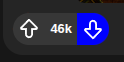

# 🎨🖌️ CSS Javító Dolgozat

## 🎯 Feladat
- A feladat egy Reddit-hez hasonlóan kinéző oldal készítése.
- Három posztot kell létrehozni és grid segítségével elrendezni

## 🖥️ Oldal (6p)
- Az oldal töltse ki a maximum szélességet, de ne lógjon túl, azaz horizontálisan ne kelljen görgetni. (2p)
- A betűtípus `Arial, Helvetica, sans-serif` (1p)
- A háttérszín `rgb(23, 23, 23)` (1p)
- Az alap betűszín `fehér` (1p)
- Az elemek (a grid) az oldal közepén legyenek (1p)

## 🧱 Grid (7p)
- 2 oszlopból és 2 sorból álljon, a 3. poszt két oszlopot foglaljon el (4p)
- A posztban lévő elemek elrendezése alkalmazkodjon a széles poszthoz
    - Értsd: Dinamikusan legyenek az elemek elrendezve, ne margókkal toljuk ki szélre, vagy középre. (3p)

## 📝 Post (3p)
- Háttérszíne `rgb(37, 37, 37)` (1p)
- Legyenek lekerekített sarkai (1p)
- Az elemek oszloposan, egymás alá legyenek elrendezve (1p)

### 👨🏻‍💻 Fejléc (5p)
- A fejléc bal szélén jelenjen meg a `profile.png`, mellette `"u/photographer"` felhasználónév és `"1 yr. ago"` timestamp egymás alatt (3p)
    - A timestamp betűszíne `rgb(209, 209, 209)` (1p)
- A fejléc jobb szélén az `options.svg` jelenjen meg (1p)

### 📰 Tartalom (4p)
- Az elemek vertikálisan oszloposan legyenek középre rendezve (1p)
- Jelenlen meg egy cím `24px` betűmérettel és félkövéren és a szöveg bal oldalra legyen rendezve (2p)
- Jelenjen meg a `post-img.jpeg` horizontálisan középen, lekerekített sarkokkal. (1p)

### 🕹️ Lábléc (13p)
- Az elemek bal oldalon kis távolsággal, vertikálisan középen jelenjenek meg. (1p)
- 4 gombot jelenítsen meg `rgb(55, 55, 55)` háttérszínnel (1p)
- Az első két gombot oldja meg úgy, hogy egy gombnak tűnjön, tartalmazza az `up.svg` és `down.svg` képeket és közte a `"46k"` szöveget. Legyen lekerekített sarka és vertikálisan középen legyenek az elemek. (5p)
    - Az `up.svg`-t tartalmazó gombra ha a user ráviszi az egeret, akkor csak az a gomb `#FF4500` háttérszínnel és bal oldalt lekerekített, jobb oldalt szögletes sarkokkal jelenjen meg. (2p)

    

    - A `down.svg`-t tartalmazó gombra ha a user ráviszi az egeret, akkor csak az a gomb `kék` háttérszínnel és jobb oldalt lekerekített, bal oldalt szögletes sarkokkal jelenjen meg. (2p)

    

- A harmadik gomb tartalmazza a `comment.svg`-t és a `"275"` szöveget, lekerekített sarkokkal rendelkezzen. (1p)
- A negyedik gomb tartalmazza a `share.svg` képet és a "Share" szöveget,lekerekített sarkokkal rendelkezzen.(1p)

## 💯 Értékelés
**Összesen: `38p`**
| **Pont** | **Jegy** |
|:--------:|:--------:|
|   >=34   |     5    |
|    28    |     4    |
|    23    |     3    |
|    15    |     2    |
|    <15   |     1    |
